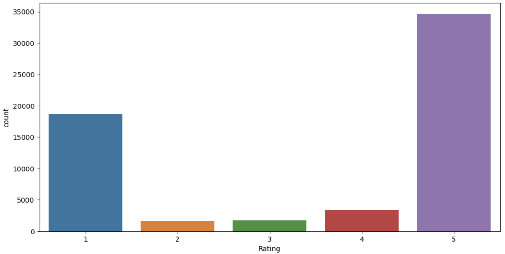
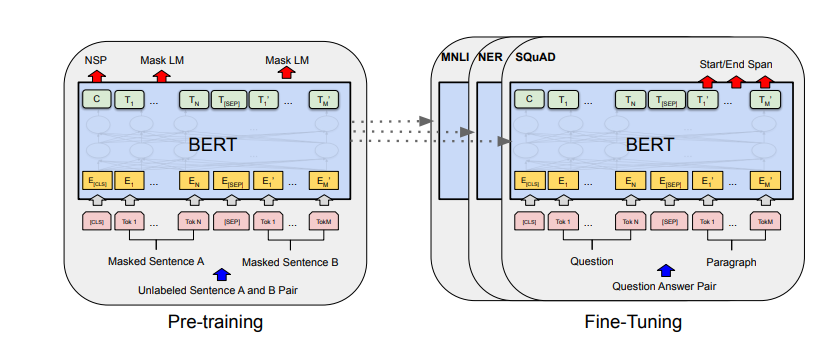

# Semantic-CorpRate

This project solves the problem of predicting a company's rating based on text reviews left by customers is an 
important one for several reasons using sentence transformers

Telegram bot based on GPT-4 and distilbert.

- The bot can communicate by text, as well as video circles! To start communicating, just say hello to the bot. 
- To change the type of responses - go to "/settings".

- The bot can also calculate the company's rating based on a text reviews. To start calculating, go to '/settings' 
and choose variant "Сделать что то полезное" -> "Рейтинг по отзыву".

## RUN:

Clone repository 
- git clone https://gitlab.com/kikikita/semantic-corprate

Build docker-image
- docker build -t semantic_bot .

Change docker-compose.yaml vars:
- TOKEN: ... [enter your token]
- GPT_TOKEN: ... [enter your GPT token]

Run docker-compose
- docker-compose up

Project Organization
------------

    ├── notebooks          <- Jupyter notebooks with experiments and logs.
    │
    ├── reports            <- A PDF with motivation, experiments setup and results.
    │   └── figures        <- Generated graphics and figures used in reporting
    │
    ├── src                <- Source code for use in this project.
    │   ├── bot
    │   │   ├── db              <- Init files for bot (database).
    │   │   ├── bot_models      <- Model inferense in bot.
    │   │   ├── handlers        <- Init files for bot (dialog).
    │   │   ├── keyboards       <- Init files for bot (navigation).
    │   │   ├── temp            <- Temporary files.
    │   │   ├── bot_telegram.py <- Starting bot.
    │   │   └── create_bot.py   <- Create bot.
    │   └── models         <- Scripts to train models and then use trained models to make
    │       │                 predictions
    │       ├── launch_train.sh <- Sh script to start training models
    │       ├── train_config.json
    │       └── train_model.py
    │
    ├── docker-compose.yaml <- docker settings
    │
    ├── Dockerfile         <- makes project pip installable so src can be imported in docker container
    │
    ├── LICENSE
    │
    ├── README.md          <- The top-level README for developers using this project.
    │
    └── requirements.txt   <- The requirements file for reproducing the analysis environment

--------

# Dataset

The dataset that we use in our work is taken from a Kaggle competition called 
["Sentiment Analysis - Company Reviews"](https://www.kaggle.com/competitions/sentiment-analysis-company-reviews/data). 
It consists of 100,000 reviews collected from Trustpilot and spans over 45 different companies. 
The dataset has three columns: Id - Unique id of each review, Review - Customer review (text) 
and Rating - Number of stars awarded by customer, between 1 and 5. The samples are split according 
to: 60% train, 10% public leaderboard and 30% private leaderboard. The target is a star rating between 
1 and 5. Data distribution shown below.

# Model

BERT is an acronym for Bidirectional Encoder Representations from Transformers, 
transformer - based pre-trained model. BERT’s key technical innovation is applying the bidirectional 
training of Transformer, a popular attention model, to language modelling. This is in contrast to previous 
efforts which looked at a text sequence either from left to right or combined left-to-right and right-to-left training.

## Training
Before feeding word sequences into BERT, 15% part of the words in each sequence are replaced with a [MASK] token. 
The model then attempts to predict the original value of the masked words, based on the context provided by the other, 
non-masked, words in the sequence. This approach is called pre-training.
In the BERT training process, the model receives pairs of sentences (in our case is just one sentence and label) 
as input and learns to predict if the second sentence in the pair is the subsequent sentence in the original document. 
During training, 50% of the inputs are a pair in which the second sentence is the subsequent sentence in the original 
document, while in the other 50% a random sentence from the corpus is chosen as the second sentence. The assumption is 
that the random sentence will be disconnected from the first sentence. This approach is called fine-tuning.

## Hyperparameters
We denote the number of layers (i.e., Transformer blocks) as L, the hidden size as H, and the number of self-attention 
heads as A. To fine-tune on our task, we used a BERT-base model (L=12, H=768, A=12, Total Parameters=110M) with batch 
size of 16 and fine-tune for 3 epochs over the data for all train dataset. We selected default (2e-5) learning rate. 
Optimizer is AdamW.

## Inference
When we want to make predictions on new test data, then once model training is complete, we can put our goal sentence 
into BERT, and we will receive the score distribution over label space, where the highest score is prediction of our 
model for the goal sentence, and the index of this score is label.
